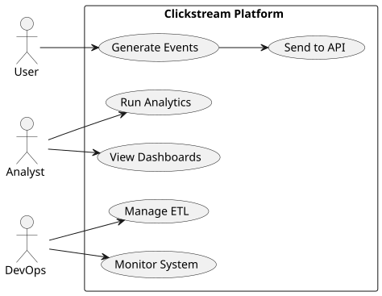
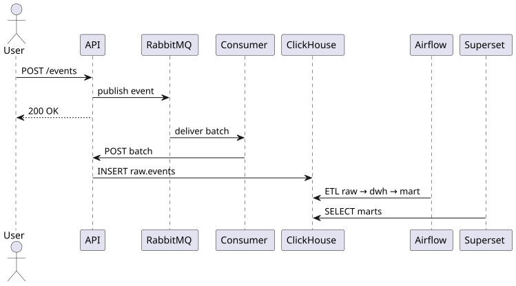
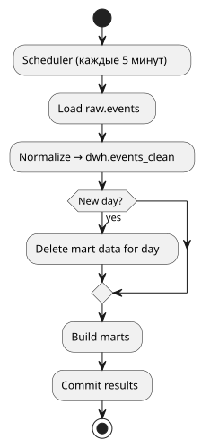
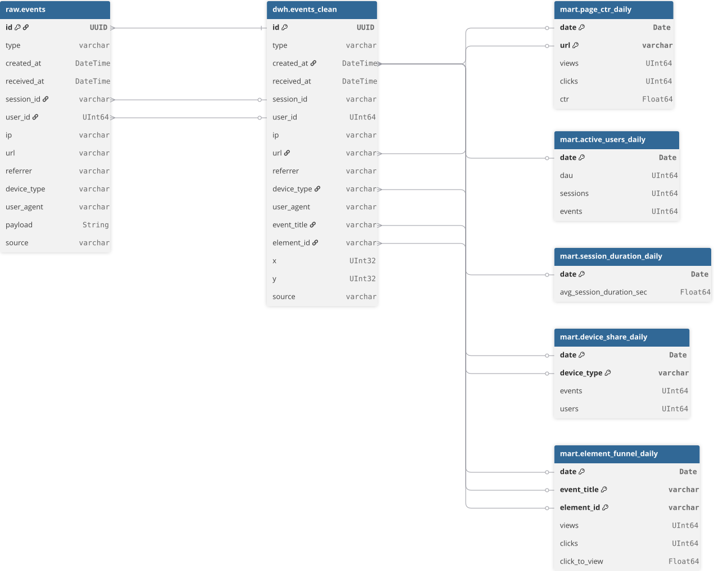
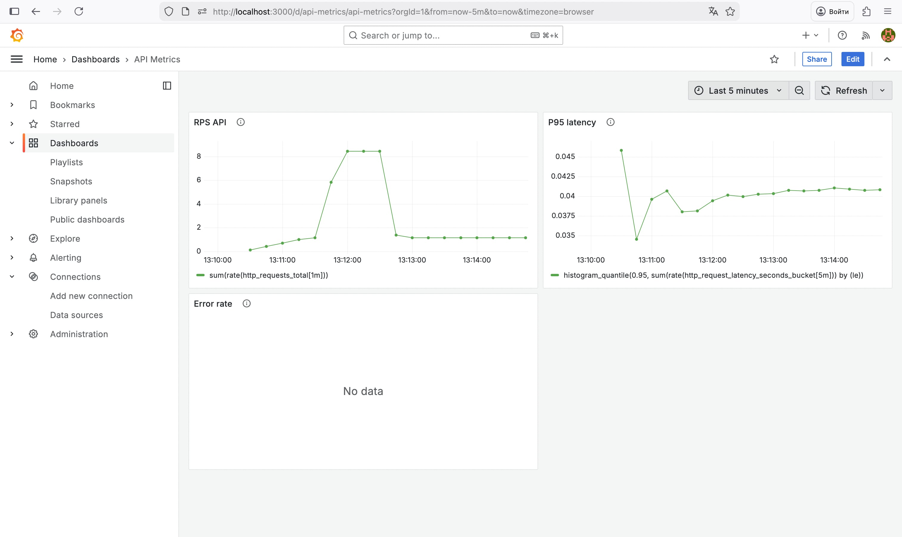
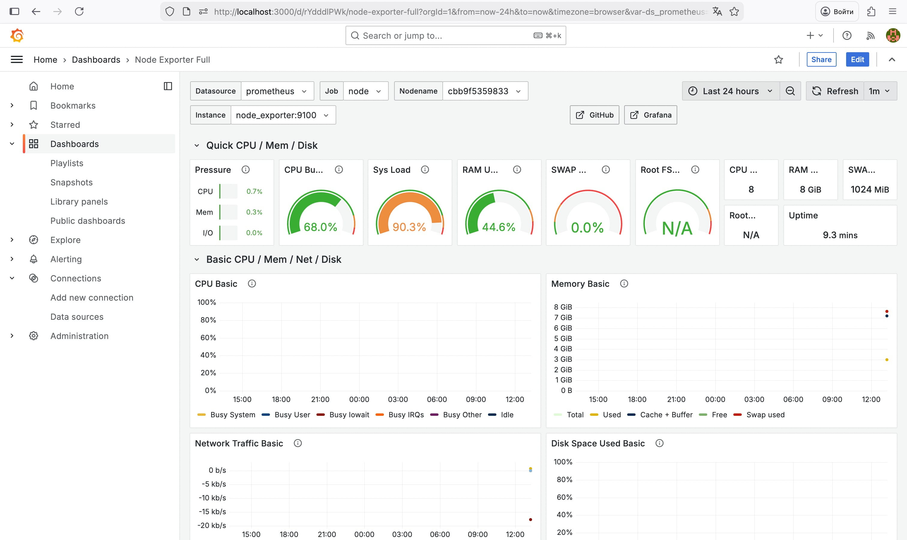
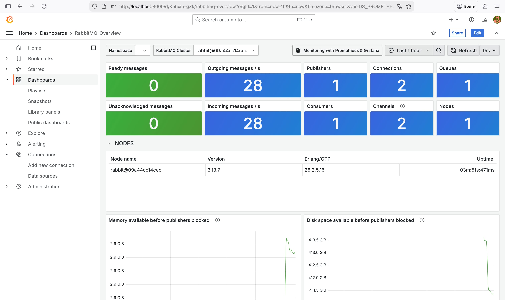
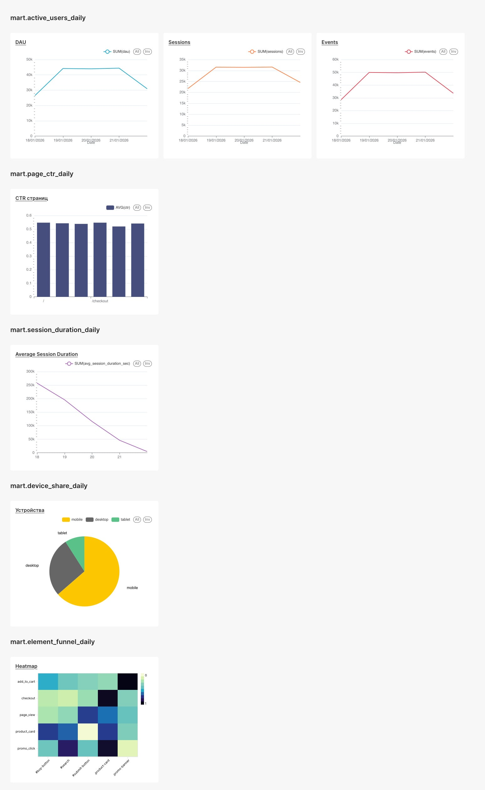

# Clickstream Analytics Platform

## Введение

### Описание проекта

Данный проект представляет собой аналитическую платформу для сбора, обработки и анализа clickstream-событий пользователей веб-приложения.

**Объект исследования** – поведение пользователей на веб-сайте.

**Предмет исследования** – процессы сбора, обработки и аналитики пользовательских событий (просмотры страниц, клики, взаимодействие с элементами интерфейса).

Платформа реализует полный data-pipeline:

- прием событий через REST API и брокер сообщений
- хранение сырых данных
- очистку и нормализацию событий
- построение аналитических витрин
- визуализацию метрик и мониторинг инфраструктуры

Решение ориентировано на работу с большими объемами событийных данных и демонстрирует подходы, применяемые в промышленной аналитике (Product / Web / Marketing Analytics).

### Стек технологий

Основные технологии:

<p>
    &nbsp
    &nbsp
    &nbsp;
    &nbsp
    &nbsp
    &nbsp
    &nbsp
    &nbsp;
    
</p>

## Запуск

#### Требования

- Docker ≥ 24
- Docker Compose ≥ 2.0
- Свободные порты: 4015, 8123, 9000, 15672, 9090, 3000, 5080

#### Запуск проекта

```bash
docker compose build
docker compose up -d
```

После запуска будут доступны:

| Компонент       | URL                    |
|-----------------|------------------------|
| API             | http://localhost:4015  |
| ClickHouse HTTP | http://localhost:8123  |
| RabbitMQ UI     | http://localhost:15672 |
| Prometheus      | http://localhost:9090  |
| Grafana         | http://localhost:3000  |
| Airflow UI      | http://localhost:5080  |
| Apache Superset | http://localhost:8088  |

**Учетные данные:**

- RabbitMQ: guest / guest
- Grafana: admin / admin
- Airflow: admin / admin
- Apache Superset: admin / admin

## Основная часть

### Анализ предметной области

#### Обоснование архитектуры

Выбранная архитектура соответствует классической схеме **event-driven analytics**:

- асинхронная доставка событий через брокер сообщений
- OLAP-хранилище для аналитических запросов
- отдельный слой ETL для подготовки данных
- мониторинг как обязательный компонент production-системы

Такой подход позволяет:

- масштабировать ingestion независимо от аналитики
- обрабатывать высокий RPS
- изолировать «сырые» и «чистые» данные

#### Обзор существующих решений

Аналогичные архитектуры используются в:

- Google Analytics (внутренняя архитектура)
- Amplitude
- Mixpanel
- Яндекс Метрика (event ingestion + OLAP)

#### Использование технологий

| Компонент     | Технология | Назначение              |
|---------------|------------|-------------------------|
| Ingest API    | FastAPI    | Прием событий           |
| Broker        | RabbitMQ   | Асинхронная доставка    |
| Storage       | ClickHouse | Аналитическое хранилище |
| ETL           | Airflow    | Очистка и витрины       |
| Monitoring    | Prometheus | Метрики                 |
| Visualization | Grafana    | Дашборды                |
| Visualization | Superset   | Аналитические дашборды  |

<!--
#### Архитектура приложения

- Предоставьте **расчеты** нагрузки и требуемых **ресурсов** (память/процессор) для вашей системы.
-->

### Проектирование

#### UML-диаграммы

**Use Case Diagram (сценарии использования)**



Пользователь генерирует события, аналитик работает с витринами, DevOps отвечает за стабильность и ETL.

**Sequence Diagram (путь события)**



События асинхронны, ingestion и аналитика полностью разделены.

**Activity Diagram (ETL в Airflow)**



ETL инкрементальный (5 минут) + daily rebuild витрин через DELETE + INSERT.

#### Схема баз данных



#### Описание API

**POST /events** (принимает список событий)

Пример запроса:

```json
[
  {
    "type": "click",
    "created_at": "2025-01-01T10:00:00Z",
    "session_id": "session-123",
    "user_id": 1001,
    "url": "/checkout",
    "referrer": "https://example.com",
    "device_type": "mobile",
    "user_agent": "Mozilla/5.0",
    "ip": "1.2.3.4",
    "payload": {
      "event_title": "checkout",
      "element_id": "#submit-button",
      "x": 445,
      "y": 315
    }
  }
]
```

Ответ:

```json
{
  "inserted": 1
}
```

#### Дашборды Grafana

- API Metrics - [JSON](./assets/metrics_grafana.json)
- Infrastructure - ID 1860
- RabbitMQ - ID 10991







#### Дашборды Apache Superset




### Тестирование

В проекте реализовано **модульное и интеграционное тестирование** всех ключевых компонентов системы.

#### Подход к тестированию

**Модульные тесты**

Модульные тесты покрывают бизнес-логику отдельных компонентов:

- обработку и агрегацию clickstream-событий
- формирование и обновление Prometheus-метрик
- batching и flush-логику consumer
- преобразование данных перед загрузкой в ClickHouse
- вспомогательные функции и утилиты

**Интеграционные тесты**

Интеграционные тесты проверяют взаимодействие компонентов системы:

- HTTP-контракты между consumer и API
- корректность работы Prometheus middleware
- асинхронные сценарии записи данных в ClickHouse
- обработку ошибок внешних сервисов

#### Покрытие тестами

- `pytest` — фреймворк для тестирования
- `pytest-asyncio` — поддержка асинхронных тестов
- `pytest-cov` — интеграция тестов с отчетами покрытия
- `coverage.py` — расчет и анализ покрытия кода

Запуск всех тестов проекта:

```bash
python3 -m pytest tests --cov=services --cov-report=term
```

#### Тестовые данные

Информация о использование тестовых данных представлена в [README](./data/README.md) в директории `/data`

#### Демонстрация API

Для демонстрации и тестирования REST API используются Swagger, доступный по адресу

```
http://localhost:4015/docs
```


## Заключение

### Краткие выводы

В рамках проекта реализована полнофункциональная clickstream-платформа, охватывающая все этапы работы с данными – от ingestion до аналитики и мониторинга.

Система демонстрирует стабильную работу при средней нагрузке и легко масштабируется горизонтально.

### Результаты

- Реализован production-подобный data-pipeline
- Подготовлены аналитические витрины
- Настроен мониторинг инфраструктуры
- Обеспечена повторяемость ETL-процессов

### Перспективы развития

- Хранение пользователей и enrichment данных
- Горизонтальное масштабирование API
- Использование Kafka вместо RabbitMQ
- Добавление алертинга в Grafana